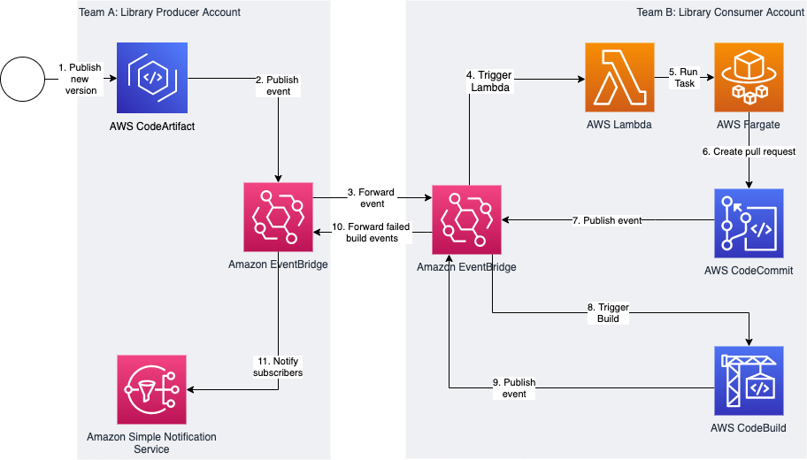

# Keeping up with your dependencies: building a feedback loop for shared libraries
This repo accompanies the blog post "Keeping up with your dependencies: building a feedback loop for shared libraries" available at <LINK_TO_BLOG_POST>.
For a detailed description of the whole solution please refer to the blog post.

## Overview

The sample code of this repository automatically updates a maven dependency upon a new version release in AWS CodeArtifact.
This sample assumes that there are two AWS Accounts involved. One is releasing the library ("Producer Account"), the other one is consuming the library ("Consumer Account").




## Prerequisites

- Two AWS accounts (one shared library producer, one shared library consumer)
- Installed [AWS CDK](https://docs.aws.amazon.com/cdk/latest/guide/getting_started.html#getting_started_install)
- Installed [CDK Assume Role Credential Plugin](https://github.com/aws-samples/cdk-assume-role-credential-plugin)  
- Git configured for AWS CodeCommit usage (https://docs.aws.amazon.com/codecommit/latest/userguide/setting-up-https-unixes.html#setting-up-https-unixes-credential-helper)
- Maven configured for AWS CodeArtifact (https://docs.aws.amazon.com/codeartifact/latest/ug/maven-mvn.html)


## Deploying the solution

To deploy the CDK Stack execute the following steps:

```
cd cdk
npm install
npx cdk deploy --context region=<YOUR_DESIRED_REGION> --context producerAccount=<ACCOUNT_NO_LIBRARY_PRODUCER> --context consumerAccount=<ACCOUNT_NO_LIBRARY_CONSUMER> --all
```

CDK will print some outputs with export commands to set the environment.


## Testing the solution:
In order to test the solution we need to push our consumer code to the AWS CodeCommit repository. We also need to release a new version of the shared library.
In a real world scenario the used git repo for the library consumer would reside in a directory not included in this repository. However, to include everything needed to run this example here we will just push our subdirectory (as a new repo) to AWS CodeCommit.  


### Pushing the code to CodeCommit
From a console which uses the credentials necessary to push to the Consumer Account's CodeCommit:
```
cd library/consumer/library
git init
git add .
git commit -m "Initial Commit"
git push --set-upstream $CODECOMMIT_URL main
``` 

### Release a new version of the library:
Make sure you have set up Maven to use AWS CodeArtifact. See https://docs.aws.amazon.com/codeartifact/latest/ug/maven-mvn.html for details.  
In a real world scenario the `mvn deploy` would likely be triggered by a CI/CD pipeline of the library producer team. 

```
cd library_producer/library
sed -i '' 's/<version>1.0.0/<version>1.0.1/' pom.xml
mvn --settings settings.xml deploy
```

This kicks off the whole process. To follow along look at the logs produced by the Lambda function in the consumer account or check the ECS task which will be started by the Lambda function.
After the process finishes a new PR exists in your CodeCommit repository with the library version bumped to the last release.


## Security

See [CONTRIBUTING](CONTRIBUTING.md#security-issue-notifications) for more information.

## License

This library is licensed under the MIT-0 License. See the LICENSE file.
